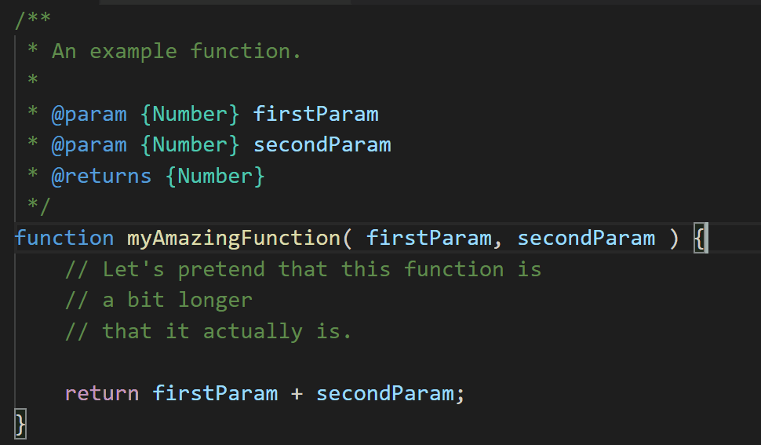

# vscode-selection-flip

 

VSCode extensions that allows you to flip over your selection anchor point.

## Use Case

I sometimes have a need to select whole function and its API docs at once, using keyboard only. Currently I use

## License

The code is distributed under MIT license.